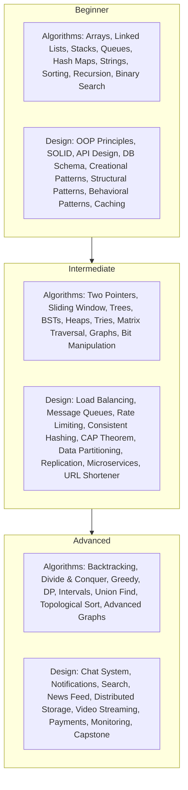

# Computer Science Training Curriculum

A structured, year-long computer science training plan covering algorithms, data structures, and system design. The curriculum is organized into 52 concept modules across two parallel tracks, each containing daily practice problems solvable in 30–60 minutes.

## Tracks

- [Algorithms & Data Structures](algorithms-and-data-structures/README.md) — 26 modules covering arrays through advanced graph algorithms
- [Design Concepts](design-concepts/README.md) — 26 modules covering OOP principles through end-to-end system design

## Curriculum Overview Diagram

Mermaid Source

## All Concept Modules

| Track | Concept | Difficulty Tier | Link |
|-------|---------|----------------|------|
| Algorithms & Data Structures | Arrays | Beginner | [Arrays](algorithms-and-data-structures/arrays/README.md) |
| Design Concepts | Object-Oriented Design Principles | Beginner | [OOP Principles](design-concepts/object-oriented-design-principles/README.md) |
| Algorithms & Data Structures | Linked Lists | Beginner | [Linked Lists](algorithms-and-data-structures/linked-lists/README.md) |
| Design Concepts | SOLID Principles | Beginner | [SOLID Principles](design-concepts/solid-principles/README.md) |
| Algorithms & Data Structures | Stacks | Beginner | [Stacks](algorithms-and-data-structures/stacks/README.md) |
| Design Concepts | API Design | Beginner | [API Design](design-concepts/api-design/README.md) |
| Algorithms & Data Structures | Queues | Beginner | [Queues](algorithms-and-data-structures/queues/README.md) |
| Design Concepts | Database Schema Design | Beginner | [DB Schema Design](design-concepts/database-schema-design/README.md) |
| Algorithms & Data Structures | Hash Maps | Beginner | [Hash Maps](algorithms-and-data-structures/hash-maps/README.md) |
| Design Concepts | Design Patterns (Creational) | Beginner | [Creational Patterns](design-concepts/design-patterns-creational/README.md) |
| Algorithms & Data Structures | String Manipulation | Beginner | [String Manipulation](algorithms-and-data-structures/string-manipulation/README.md) |
| Design Concepts | Design Patterns (Structural) | Beginner | [Structural Patterns](design-concepts/design-patterns-structural/README.md) |
| Algorithms & Data Structures | Sorting Algorithms | Beginner | [Sorting Algorithms](algorithms-and-data-structures/sorting-algorithms/README.md) |
| Design Concepts | Design Patterns (Behavioral) | Beginner | [Behavioral Patterns](design-concepts/design-patterns-behavioral/README.md) |
| Algorithms & Data Structures | Recursion | Beginner | [Recursion](algorithms-and-data-structures/recursion/README.md) |
| Design Concepts | Caching Strategies | Beginner | [Caching Strategies](design-concepts/caching-strategies/README.md) |
| Algorithms & Data Structures | Binary Search | Beginner | [Binary Search](algorithms-and-data-structures/binary-search/README.md) |
| Design Concepts | Load Balancing | Intermediate | [Load Balancing](design-concepts/load-balancing/README.md) |
| Algorithms & Data Structures | Two Pointers | Intermediate | [Two Pointers](algorithms-and-data-structures/two-pointers/README.md) |
| Design Concepts | Message Queues | Intermediate | [Message Queues](design-concepts/message-queues/README.md) |
| Algorithms & Data Structures | Sliding Window | Intermediate | [Sliding Window](algorithms-and-data-structures/sliding-window/README.md) |
| Design Concepts | Rate Limiting | Intermediate | [Rate Limiting](design-concepts/rate-limiting/README.md) |
| Algorithms & Data Structures | Trees | Intermediate | [Trees](algorithms-and-data-structures/trees/README.md) |
| Design Concepts | Consistent Hashing | Intermediate | [Consistent Hashing](design-concepts/consistent-hashing/README.md) |
| Algorithms & Data Structures | Binary Search Trees | Intermediate | [Binary Search Trees](algorithms-and-data-structures/binary-search-trees/README.md) |
| Design Concepts | CAP Theorem | Intermediate | [CAP Theorem](design-concepts/cap-theorem/README.md) |
| Algorithms & Data Structures | Heaps | Intermediate | [Heaps](algorithms-and-data-structures/heaps/README.md) |
| Design Concepts | Data Partitioning | Intermediate | [Data Partitioning](design-concepts/data-partitioning/README.md) |
| Algorithms & Data Structures | Tries | Intermediate | [Tries](algorithms-and-data-structures/tries/README.md) |
| Design Concepts | Replication Strategies | Intermediate | [Replication Strategies](design-concepts/replication-strategies/README.md) |
| Algorithms & Data Structures | Matrix Traversal | Intermediate | [Matrix Traversal](algorithms-and-data-structures/matrix-traversal/README.md) |
| Design Concepts | Microservices Architecture | Intermediate | [Microservices](design-concepts/microservices-architecture/README.md) |
| Algorithms & Data Structures | Graphs | Intermediate | [Graphs](algorithms-and-data-structures/graphs/README.md) |
| Design Concepts | URL Shortener Design | Intermediate | [URL Shortener](design-concepts/url-shortener-design/README.md) |
| Algorithms & Data Structures | Bit Manipulation | Intermediate | [Bit Manipulation](algorithms-and-data-structures/bit-manipulation/README.md) |
| Design Concepts | Chat System Design | Advanced | [Chat System](design-concepts/chat-system-design/README.md) |
| Algorithms & Data Structures | Backtracking | Advanced | [Backtracking](algorithms-and-data-structures/backtracking/README.md) |
| Design Concepts | Notification System Design | Advanced | [Notifications](design-concepts/notification-system-design/README.md) |
| Algorithms & Data Structures | Divide and Conquer | Advanced | [Divide and Conquer](algorithms-and-data-structures/divide-and-conquer/README.md) |
| Design Concepts | Search System Design | Advanced | [Search System](design-concepts/search-system-design/README.md) |
| Algorithms & Data Structures | Greedy Algorithms | Advanced | [Greedy Algorithms](algorithms-and-data-structures/greedy-algorithms/README.md) |
| Design Concepts | News Feed Design | Advanced | [News Feed](design-concepts/news-feed-design/README.md) |
| Algorithms & Data Structures | Dynamic Programming | Advanced | [Dynamic Programming](algorithms-and-data-structures/dynamic-programming/README.md) |
| Design Concepts | Distributed File Storage Design | Advanced | [Distributed Storage](design-concepts/distributed-file-storage-design/README.md) |
| Algorithms & Data Structures | Interval Problems | Advanced | [Interval Problems](algorithms-and-data-structures/interval-problems/README.md) |
| Design Concepts | Video Streaming Design | Advanced | [Video Streaming](design-concepts/video-streaming-design/README.md) |
| Algorithms & Data Structures | Union Find | Advanced | [Union Find](algorithms-and-data-structures/union-find/README.md) |
| Design Concepts | Payment System Design | Advanced | [Payment System](design-concepts/payment-system-design/README.md) |
| Algorithms & Data Structures | Topological Sort | Advanced | [Topological Sort](algorithms-and-data-structures/topological-sort/README.md) |
| Design Concepts | Monitoring & Observability | Advanced | [Monitoring](design-concepts/monitoring-and-observability/README.md) |
| Algorithms & Data Structures | Advanced Graph Algorithms | Advanced | [Advanced Graphs](algorithms-and-data-structures/advanced-graph-algorithms/README.md) |
| Design Concepts | Capstone: End-to-End System Design | Advanced | [Capstone](design-concepts/capstone-end-to-end-system-design/README.md) |
