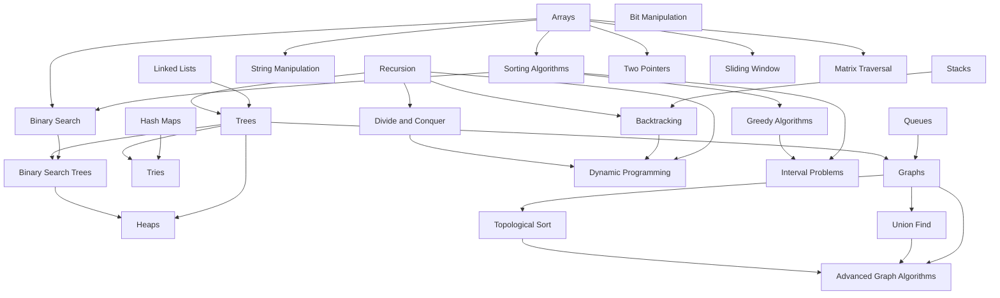

# Algorithms & Data Structures

This track covers 26 core computer science concepts, progressing from foundational data structures through intermediate techniques to advanced algorithmic paradigms. Each module focuses on a single concept and contains 3–10 daily practice problems (30–60 minutes each), ordered from easier to harder. Modules are identified by concept name and can be studied in any order that respects the prerequisite graph below.

## Prerequisite Knowledge Graph

The following diagram shows the prerequisite relationships between concepts in this track. Arrows point from prerequisite to dependent concept.

## Concept Modules

| Concept | Difficulty Tier | Prerequisites | Link |
|---------|----------------|---------------|------|
| Arrays | Beginner | None | [Arrays](arrays/README.md) |
| Linked Lists | Beginner | None | [Linked Lists](linked-lists/README.md) |
| Stacks | Beginner | None | [Stacks](stacks/README.md) |
| Queues | Beginner | None | [Queues](queues/README.md) |
| Hash Maps | Beginner | None | [Hash Maps](hash-maps/README.md) |
| String Manipulation | Beginner | Arrays | [String Manipulation](string-manipulation/README.md) |
| Sorting Algorithms | Beginner | Arrays | [Sorting Algorithms](sorting-algorithms/README.md) |
| Recursion | Beginner | None | [Recursion](recursion/README.md) |
| Binary Search | Beginner | Arrays, Sorting Algorithms | [Binary Search](binary-search/README.md) |
| Two Pointers | Intermediate | Arrays | [Two Pointers](two-pointers/README.md) |
| Sliding Window | Intermediate | Arrays | [Sliding Window](sliding-window/README.md) |
| Trees | Intermediate | Linked Lists, Recursion | [Trees](trees/README.md) |
| Binary Search Trees | Intermediate | Binary Search, Trees | [Binary Search Trees](binary-search-trees/README.md) |
| Heaps | Intermediate | Trees, Binary Search Trees | [Heaps](heaps/README.md) |
| Tries | Intermediate | Hash Maps, Trees | [Tries](tries/README.md) |
| Matrix Traversal | Intermediate | Arrays | [Matrix Traversal](matrix-traversal/README.md) |
| Graphs | Intermediate | Queues, Trees | [Graphs](graphs/README.md) |
| Bit Manipulation | Intermediate | None | [Bit Manipulation](bit-manipulation/README.md) |
| Backtracking | Advanced | Stacks, Recursion | [Backtracking](backtracking/README.md) |
| Divide and Conquer | Advanced | Recursion | [Divide and Conquer](divide-and-conquer/README.md) |
| Greedy Algorithms | Advanced | Sorting Algorithms | [Greedy Algorithms](greedy-algorithms/README.md) |
| Dynamic Programming | Advanced | Recursion, Backtracking, Divide and Conquer | [Dynamic Programming](dynamic-programming/README.md) |
| Interval Problems | Advanced | Sorting Algorithms, Greedy Algorithms | [Interval Problems](interval-problems/README.md) |
| Union Find | Advanced | Graphs | [Union Find](union-find/README.md) |
| Topological Sort | Advanced | Graphs | [Topological Sort](topological-sort/README.md) |
| Advanced Graph Algorithms | Advanced | Graphs, Union Find, Topological Sort | [Advanced Graph Algorithms](advanced-graph-algorithms/README.md) |
