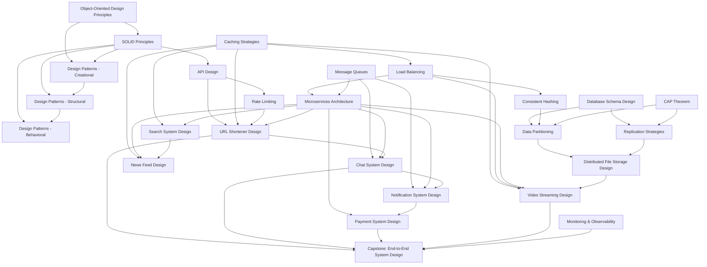

# Design Concepts

This track covers 26 modules on software design principles and system design, progressing from foundational object-oriented concepts through distributed systems building blocks to advanced end-to-end system design exercises. Each module focuses on a single concept and contains 3–10 daily practice problems (30–60 minutes each), ordered from easier to harder. Modules are identified by concept name and can be studied in any order that respects the prerequisite graph below.

## Prerequisite Knowledge Graph

The following diagram shows the prerequisite relationships between concepts in this track. Arrows point from prerequisite to dependent concept.

## Concept Modules

| Concept | Difficulty Tier | Prerequisites | Link |
|---------|----------------|---------------|------|
| Object-Oriented Design Principles | Beginner | None | [OOP Principles](object-oriented-design-principles/README.md) |
| SOLID Principles | Beginner | Object-Oriented Design Principles | [SOLID Principles](solid-principles/README.md) |
| API Design | Beginner | SOLID Principles | [API Design](api-design/README.md) |
| Database Schema Design | Beginner | None | [DB Schema Design](database-schema-design/README.md) |
| Design Patterns (Creational) | Beginner | Object-Oriented Design Principles, SOLID Principles | [Creational Patterns](design-patterns-creational/README.md) |
| Design Patterns (Structural) | Beginner | SOLID Principles, Design Patterns (Creational) | [Structural Patterns](design-patterns-structural/README.md) |
| Design Patterns (Behavioral) | Beginner | SOLID Principles, Design Patterns (Structural) | [Behavioral Patterns](design-patterns-behavioral/README.md) |
| Caching Strategies | Beginner | None | [Caching Strategies](caching-strategies/README.md) |
| Load Balancing | Intermediate | Caching Strategies | [Load Balancing](load-balancing/README.md) |
| Message Queues | Intermediate | None | [Message Queues](message-queues/README.md) |
| Rate Limiting | Intermediate | API Design | [Rate Limiting](rate-limiting/README.md) |
| Consistent Hashing | Intermediate | Load Balancing | [Consistent Hashing](consistent-hashing/README.md) |
| CAP Theorem | Intermediate | None | [CAP Theorem](cap-theorem/README.md) |
| Data Partitioning | Intermediate | Database Schema Design, Consistent Hashing, CAP Theorem | [Data Partitioning](data-partitioning/README.md) |
| Replication Strategies | Intermediate | Database Schema Design, CAP Theorem | [Replication Strategies](replication-strategies/README.md) |
| Microservices Architecture | Intermediate | Load Balancing, Message Queues | [Microservices](microservices-architecture/README.md) |
| URL Shortener Design | Intermediate | API Design, Caching Strategies, Rate Limiting, Microservices Architecture | [URL Shortener](url-shortener-design/README.md) |
| Chat System Design | Advanced | Message Queues, Microservices Architecture, URL Shortener Design | [Chat System](chat-system-design/README.md) |
| Notification System Design | Advanced | Message Queues, Microservices Architecture, Chat System Design | [Notifications](notification-system-design/README.md) |
| Search System Design | Advanced | Caching Strategies, Microservices Architecture | [Search System](search-system-design/README.md) |
| News Feed Design | Advanced | Caching Strategies, Microservices Architecture, Search System Design | [News Feed](news-feed-design/README.md) |
| Distributed File Storage Design | Advanced | Data Partitioning, Replication Strategies | [Distributed Storage](distributed-file-storage-design/README.md) |
| Video Streaming Design | Advanced | Load Balancing, Caching Strategies, Microservices Architecture, Distributed File Storage Design | [Video Streaming](video-streaming-design/README.md) |
| Payment System Design | Advanced | Microservices Architecture, Notification System Design | [Payment System](payment-system-design/README.md) |
| Monitoring & Observability | Advanced | None | [Monitoring](monitoring-and-observability/README.md) |
| Capstone: End-to-End System Design | Advanced | URL Shortener Design, Chat System Design, Payment System Design, Video Streaming Design, Monitoring & Observability | [Capstone](capstone-end-to-end-system-design/README.md) |
