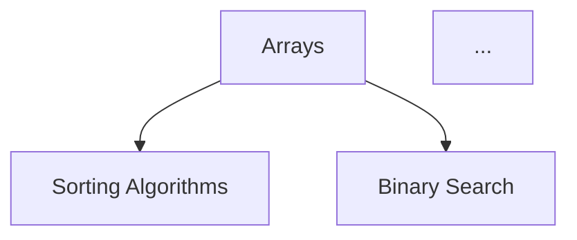
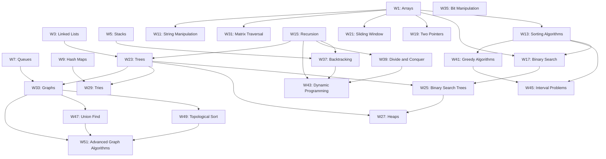
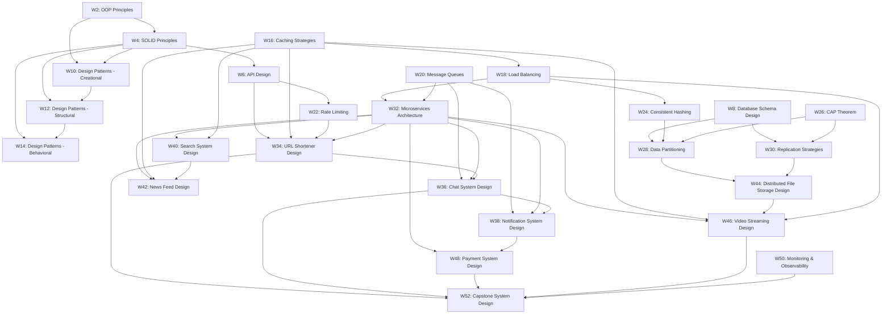

# Design Document: CS Training Curriculum

## Overview

This design describes a 52-week computer science training curriculum delivered entirely as markdown documents. There is no application code, server, or database. The deliverable is a directory tree of `.md` files organized by track and week, plus SVG diagram assets and a pre-commit git hook for automated SVG regeneration.

The curriculum has two tracks running in parallel across the year:

- **Algorithms & Data Structures** (26 weeks) — arrays through topological sort
- **Design Concepts** (26 weeks) — OOP principles through end-to-end system design

Weeks are numbered 1–52 sequentially. The two tracks interleave: odd weeks belong to Algorithms & Data Structures, even weeks belong to Design Concepts. Each week focuses on a single concept and contains 5 daily problems (Mon–Fri) with difficulty progressing from Easy to Hard across the week.

Three difficulty tiers span the year:
- **Beginner** (Weeks 1–17): foundational topics, at least 3 Easy problems per week
- **Intermediate** (Weeks 18–35): moderate topics, mixed difficulty
- **Advanced** (Weeks 36–52): complex topics, at least 3 Hard problems per week

Mermaid prerequisite graphs are embedded in track READMEs and exported as SVGs via a pre-commit hook using `mermaid-cli` (`mmdc`).

## Architecture

Since this is a pure document project, "architecture" refers to the file system layout and the relationships between documents.

### Directory Tree Structure

```
curriculum/
├── README.md                          # Top-level index with overview diagram
├── assets/
│   ├── algorithms-prerequisite-graph.svg
│   ├── design-prerequisite-graph.svg
│   └── overview-graph.svg
├── algorithms-and-data-structures/
│   ├── README.md                      # Track index with Mermaid prerequisite graph
│   ├── week-01-arrays/
│   │   └── README.md                  # Week_Plan document (concept + 5 daily problems)
│   ├── week-03-linked-lists/
│   │   └── README.md
│   ├── ...                            # (odd-numbered weeks for this track)
│   └── week-51-topological-sort/
│       └── README.md
├── design-concepts/
│   ├── README.md                      # Track index with Mermaid prerequisite graph
│   ├── week-02-oop-principles/
│   │   └── README.md                  # Week_Plan document (concept + 5 daily problems)
│   ├── week-04-solid-principles/
│   │   └── README.md
│   ├── ...                            # (even-numbered weeks for this track)
│   └── week-52-payment-system-design/
│       └── README.md
└── hooks/
    └── pre-commit                     # Git hook script for SVG generation
```

### Naming Conventions

- Week directories: `week-{NN}-{concept-slug}/` where `{NN}` is zero-padded (01–52) and `{concept-slug}` is the kebab-case concept name.
- Each week directory contains a single `README.md` that holds the full Week_Plan (concept description, prerequisites, and all 5 daily problems).
- Track directories use kebab-case: `algorithms-and-data-structures/`, `design-concepts/`.

### Interleaving Strategy

Algorithms & Data Structures occupies odd weeks (1, 3, 5, …, 51) and Design Concepts occupies even weeks (2, 4, 6, …, 52). This gives each track exactly 26 weeks and lets a learner alternate between the two disciplines throughout the year.

## Components and Interfaces

Since there is no application code, "components" are the document templates and the hook script.

### Component 1: Top-Level README.md

The top-level `curriculum/README.md` serves as the entry point. It contains:

1. A title and introduction to the curriculum
2. A table listing all 52 weeks with columns: Week #, Track, Concept, Difficulty Tier, Link
3. A simplified Mermaid overview diagram showing high-level progression across both tracks
4. The embedded SVG of the overview diagram via ``
5. Links to each track's README

### Component 2: Track README.md

Each track directory has a `README.md` containing:

1. Track title and description
2. A table listing all weeks in that track with columns: Week #, Concept, Difficulty Tier, Prerequisites, Link
3. A Mermaid prerequisite graph (inline code block) showing concept dependencies as a directed graph
4. The embedded SVG of the prerequisite graph
5. Both the Mermaid code block and the SVG image are included so the diagram renders in viewers with or without Mermaid support

#### Track README Template

```markdown
# {Track Name}

{Track description paragraph.}

## Prerequisite Knowledge Graph

The following diagram shows the prerequisite relationships between concepts in this track.
Arrows point from prerequisite to dependent concept.


<details>
<summary>Mermaid Source</summary>



</details>

## Week Plans

| Week | Concept | Difficulty Tier | Prerequisites | Link |
|------|---------|----------------|---------------|------|
| 1    | Arrays  | Beginner       | None          | [Week 1](week-01-arrays/README.md) |
| ...  | ...     | ...            | ...           | ...  |
```

### Component 3: Week_Plan Document (Week README.md)

Each week directory's `README.md` is the Week_Plan. It contains the concept description, prerequisites, and all 5 daily problems.

#### Week_Plan Template

```markdown
# Week {NN}: {Concept Name}

**Track:** {Track Name}
**Difficulty Tier:** {Beginner | Intermediate | Advanced}
**Prerequisites:** {Comma-separated list of prerequisite Week_Plan links, or "None"}

## Concept Overview

{2–4 paragraph description of the concept and its relevance to computer science.}

---

## Day 1 (Monday) — {Problem Title}

**Difficulty:** Easy
**Estimated Time:** 30 minutes

### Problem Statement

{Self-contained problem description. No external references needed.}

### Example

**Input:** {example input}
**Output:** {example output}
**Explanation:** {brief explanation}

### Hints

1. {Hint 1}

### Solution Outline

{Step-by-step approach description, not full code.}

---

## Day 2 (Tuesday) — {Problem Title}

**Difficulty:** Easy
**Estimated Time:** 35 minutes

{Same structure as Day 1...}

---

## Day 3 (Wednesday) — {Problem Title}

**Difficulty:** Medium
**Estimated Time:** 40 minutes

{Same structure...}

---

## Day 4 (Thursday) — {Problem Title}

**Difficulty:** Medium
**Estimated Time:** 50 minutes

{Same structure...}

---

## Day 5 (Friday) — {Problem Title}

**Difficulty:** Hard
**Estimated Time:** 60 minutes

{Same structure...}
```

#### Difficulty Distribution by Tier

| Tier         | Monday | Tuesday | Wednesday | Thursday | Friday |
|--------------|--------|---------|-----------|----------|--------|
| Beginner     | Easy   | Easy    | Easy      | Medium   | Hard   |
| Intermediate | Easy   | Medium  | Medium    | Hard     | Hard   |
| Advanced     | Easy   | Medium  | Hard      | Hard     | Hard   |

This ensures:
- Beginner weeks have at least 3 Easy problems (Mon, Tue, Wed)
- Advanced weeks have at least 3 Hard problems (Wed, Thu, Fri)
- Every week has at least 1 Easy (Monday) and at least 1 Hard (Friday)
- Difficulty always progresses Mon → Fri

#### Design Problem Variant

For Design Concepts track problems, the "Example" section uses a concrete scenario instead of input/output pairs:

```markdown
### Scenario

**Context:** {Real-world scenario description}
**Requirements:** {What the design must achieve}
**Expected Approach:** {Key design decisions and trade-offs to consider}
```


### Component 4: Pre-Commit Hook Script

The `hooks/pre-commit` script automates SVG generation from Mermaid code blocks.

#### Hook Design

```bash
#!/usr/bin/env bash
set -euo pipefail

CURRICULUM_DIR="$(cd "$(dirname "$0")/../.." && pwd)/curriculum"
ASSETS_DIR="$CURRICULUM_DIR/assets"

# Check mermaid-cli is installed
if ! command -v mmdc &> /dev/null; then
    echo "ERROR: mermaid-cli (mmdc) is not installed."
    echo "Install it with: npm install -g @mermaid-js/mermaid-cli"
    exit 1
fi

# Define source markdown files and their corresponding SVG outputs
declare -A DIAGRAM_MAP=(
    ["$CURRICULUM_DIR/algorithms-and-data-structures/README.md"]="$ASSETS_DIR/algorithms-prerequisite-graph.svg"
    ["$CURRICULUM_DIR/design-concepts/README.md"]="$ASSETS_DIR/design-prerequisite-graph.svg"
    ["$CURRICULUM_DIR/README.md"]="$ASSETS_DIR/overview-graph.svg"
)

REGENERATED=0

for MD_FILE in "${!DIAGRAM_MAP[@]}"; do
    SVG_FILE="${DIAGRAM_MAP[$MD_FILE]}"

    # Extract mermaid code block from markdown
    MERMAID_BLOCK=$(sed -n '/^```mermaid$/,/^```$/p' "$MD_FILE" | sed '1d;$d')

    if [ -z "$MERMAID_BLOCK" ]; then
        continue
    fi

    # Compute hash of current mermaid content
    CURRENT_HASH=$(echo "$MERMAID_BLOCK" | sha256sum | cut -d' ' -f1)

    # Check if SVG exists and compare hashes
    HASH_FILE="${SVG_FILE}.hash"
    if [ -f "$SVG_FILE" ] && [ -f "$HASH_FILE" ]; then
        STORED_HASH=$(cat "$HASH_FILE")
        if [ "$CURRENT_HASH" = "$STORED_HASH" ]; then
            continue  # Skip — no changes
        fi
    fi

    # Generate SVG
    TEMP_MMD=$(mktemp /tmp/mermaid-XXXXXX.mmd)
    echo "$MERMAID_BLOCK" > "$TEMP_MMD"

    if ! mmdc -i "$TEMP_MMD" -o "$SVG_FILE" -b transparent; then
        echo "ERROR: SVG generation failed for $MD_FILE"
        rm -f "$TEMP_MMD"
        exit 1
    fi

    rm -f "$TEMP_MMD"
    echo "$CURRENT_HASH" > "$HASH_FILE"
    git add "$SVG_FILE" "$HASH_FILE"
    REGENERATED=$((REGENERATED + 1))
done

if [ "$REGENERATED" -gt 0 ]; then
    echo "Regenerated $REGENERATED SVG diagram(s)."
fi
```

#### Hook Installation

The top-level README should document how to install the hook:

```bash
cp curriculum/hooks/pre-commit .git/hooks/pre-commit
chmod +x .git/hooks/pre-commit
```

### Component 5: Assets Directory

The `assets/` directory stores generated SVG files and their content hashes:

```
assets/
├── algorithms-prerequisite-graph.svg       # Generated from algorithms track README
├── algorithms-prerequisite-graph.svg.hash  # SHA-256 of source Mermaid block
├── design-prerequisite-graph.svg           # Generated from design track README
├── design-prerequisite-graph.svg.hash
├── overview-graph.svg                      # Generated from top-level README
└── overview-graph.svg.hash
```

The `.hash` files enable the skip-if-unchanged optimization in the pre-commit hook.

## Data Models

Since this is a document project, "data models" are the structural schemas of the markdown content.

### Week_Plan Schema

Each Week_Plan document must contain these fields:

| Field | Type | Required | Description |
|-------|------|----------|-------------|
| Week Number | Integer (1–52) | Yes | Sequential number across the curriculum |
| Concept Name | String | Yes | The CS concept for this week |
| Track | Enum: "Algorithms & Data Structures" or "Design Concepts" | Yes | Which track this week belongs to |
| Difficulty Tier | Enum: "Beginner", "Intermediate", "Advanced" | Yes | Based on week number range |
| Prerequisites | List of Week references | Yes (may be empty) | Prior weeks that should be completed first |
| Concept Description | String (2–4 paragraphs) | Yes | Explanation of the concept |
| Daily Problems | List of 5 Daily_Problem | Yes | Exactly 5 problems, one per weekday |

### Daily_Problem Schema

| Field | Type | Required | Description |
|-------|------|----------|-------------|
| Day | Enum: Monday–Friday | Yes | Which weekday |
| Title | String | Yes | Problem title |
| Difficulty Level | Enum: "Easy", "Medium", "Hard" | Yes | Must follow weekly progression |
| Estimated Time | Integer (30–60 minutes) | Yes | Expected completion time |
| Problem Statement | String | Yes | Self-contained problem description |
| Example | Input/Output pair or Scenario | Yes | At least one example |
| Hints | List of strings | Yes | At least one hint |
| Solution Outline | String | Yes | Step-by-step approach |

### Prerequisite Graph Schema

The prerequisite graph is a directed acyclic graph (DAG) where:
- **Nodes** = Concepts (one per week)
- **Edges** = Prerequisite relationships (directed from prerequisite → dependent)
- Each track has its own independent graph
- The overview graph is a simplified version showing tier-level progression across both tracks


### Full 52-Week Schedule

The interleaving assigns odd weeks to Algorithms & Data Structures (A) and even weeks to Design Concepts (D).

#### Beginner Tier (Weeks 1–17)

| Week | Track | Concept | Difficulty Distribution |
|------|-------|---------|------------------------|
| 1  | A | Arrays | E, E, E, M, H |
| 2  | D | Object-Oriented Design Principles | E, E, E, M, H |
| 3  | A | Linked Lists | E, E, E, M, H |
| 4  | D | SOLID Principles | E, E, E, M, H |
| 5  | A | Stacks | E, E, E, M, H |
| 6  | D | API Design | E, E, E, M, H |
| 7  | A | Queues | E, E, E, M, H |
| 8  | D | Database Schema Design | E, E, E, M, H |
| 9  | A | Hash Maps | E, E, E, M, H |
| 10 | D | Design Patterns (Creational) | E, E, E, M, H |
| 11 | A | String Manipulation | E, E, E, M, H |
| 12 | D | Design Patterns (Structural) | E, E, E, M, H |
| 13 | A | Sorting Algorithms | E, E, E, M, H |
| 14 | D | Design Patterns (Behavioral) | E, E, E, M, H |
| 15 | A | Recursion | E, E, E, M, H |
| 16 | D | Caching Strategies | E, E, E, M, H |
| 17 | A | Binary Search | E, E, E, M, H |

#### Intermediate Tier (Weeks 18–35)

| Week | Track | Concept | Difficulty Distribution |
|------|-------|---------|------------------------|
| 18 | D | Load Balancing | E, M, M, H, H |
| 19 | A | Two Pointers | E, M, M, H, H |
| 20 | D | Message Queues | E, M, M, H, H |
| 21 | A | Sliding Window | E, M, M, H, H |
| 22 | D | Rate Limiting | E, M, M, H, H |
| 23 | A | Trees | E, M, M, H, H |
| 24 | D | Consistent Hashing | E, M, M, H, H |
| 25 | A | Binary Search Trees | E, M, M, H, H |
| 26 | D | CAP Theorem | E, M, M, H, H |
| 27 | A | Heaps | E, M, M, H, H |
| 28 | D | Data Partitioning | E, M, M, H, H |
| 29 | A | Tries | E, M, M, H, H |
| 30 | D | Replication Strategies | E, M, M, H, H |
| 31 | A | Matrix Traversal | E, M, M, H, H |
| 32 | D | Microservices Architecture | E, M, M, H, H |
| 33 | A | Graphs | E, M, M, H, H |
| 34 | D | URL Shortener Design | E, M, M, H, H |
| 35 | A | Bit Manipulation | E, M, M, H, H |

#### Advanced Tier (Weeks 36–52)

| Week | Track | Concept | Difficulty Distribution |
|------|-------|---------|------------------------|
| 36 | D | Chat System Design | E, M, H, H, H |
| 37 | A | Backtracking | E, M, H, H, H |
| 38 | D | Notification System Design | E, M, H, H, H |
| 39 | A | Divide and Conquer | E, M, H, H, H |
| 40 | D | Search System Design | E, M, H, H, H |
| 41 | A | Greedy Algorithms | E, M, H, H, H |
| 42 | D | News Feed Design | E, M, H, H, H |
| 43 | A | Dynamic Programming | E, M, H, H, H |
| 44 | D | Distributed File Storage Design | E, M, H, H, H |
| 45 | A | Interval Problems | E, M, H, H, H |
| 46 | D | Video Streaming Design | E, M, H, H, H |
| 47 | A | Union Find | E, M, H, H, H |
| 48 | D | Payment System Design | E, M, H, H, H |
| 49 | A | Topological Sort | E, M, H, H, H |
| 50 | D | Monitoring & Observability Design | E, M, H, H, H |
| 51 | A | Advanced Graph Algorithms | E, M, H, H, H |
| 52 | D | Capstone: End-to-End System Design | E, M, H, H, H |

**Legend:** E = Easy, M = Medium, H = Hard

**Track totals:** Algorithms & Data Structures = 26 weeks (odd), Design Concepts = 26 weeks (even).


### Prerequisite Graph: Algorithms & Data Structures Track



#### Prerequisite Edges (Algorithms & Data Structures)

| Concept (Week) | Prerequisites |
|----------------|---------------|
| W1: Arrays | None |
| W3: Linked Lists | None |
| W5: Stacks | None |
| W7: Queues | None |
| W9: Hash Maps | None |
| W11: String Manipulation | W1: Arrays |
| W13: Sorting Algorithms | W1: Arrays |
| W15: Recursion | None |
| W17: Binary Search | W1: Arrays, W13: Sorting Algorithms |
| W19: Two Pointers | W1: Arrays |
| W21: Sliding Window | W1: Arrays |
| W23: Trees | W3: Linked Lists, W15: Recursion |
| W25: Binary Search Trees | W17: Binary Search, W23: Trees |
| W27: Heaps | W23: Trees, W25: Binary Search Trees |
| W29: Tries | W9: Hash Maps, W23: Trees |
| W31: Matrix Traversal | W1: Arrays |
| W33: Graphs | W7: Queues, W23: Trees |
| W35: Bit Manipulation | None |
| W37: Backtracking | W5: Stacks, W15: Recursion |
| W39: Divide and Conquer | W15: Recursion |
| W41: Greedy Algorithms | W13: Sorting Algorithms |
| W43: Dynamic Programming | W15: Recursion, W37: Backtracking, W39: Divide and Conquer |
| W45: Interval Problems | W13: Sorting Algorithms, W41: Greedy Algorithms |
| W47: Union Find | W33: Graphs |
| W49: Topological Sort | W33: Graphs |
| W51: Advanced Graph Algorithms | W33: Graphs, W47: Union Find, W49: Topological Sort |

### Prerequisite Graph: Design Concepts Track



#### Prerequisite Edges (Design Concepts)

| Concept (Week) | Prerequisites |
|----------------|---------------|
| W2: OOP Principles | None |
| W4: SOLID Principles | W2: OOP Principles |
| W6: API Design | W4: SOLID Principles |
| W8: Database Schema Design | None |
| W10: Design Patterns (Creational) | W2: OOP Principles, W4: SOLID Principles |
| W12: Design Patterns (Structural) | W4: SOLID Principles, W10: Design Patterns (Creational) |
| W14: Design Patterns (Behavioral) | W4: SOLID Principles, W12: Design Patterns (Structural) |
| W16: Caching Strategies | None |
| W18: Load Balancing | W16: Caching Strategies |
| W20: Message Queues | None |
| W22: Rate Limiting | W6: API Design |
| W24: Consistent Hashing | W18: Load Balancing |
| W26: CAP Theorem | None |
| W28: Data Partitioning | W8: Database Schema Design, W24: Consistent Hashing, W26: CAP Theorem |
| W30: Replication Strategies | W8: Database Schema Design, W26: CAP Theorem |
| W32: Microservices Architecture | W18: Load Balancing, W20: Message Queues |
| W34: URL Shortener Design | W6: API Design, W16: Caching Strategies, W22: Rate Limiting, W32: Microservices Architecture |
| W36: Chat System Design | W20: Message Queues, W32: Microservices Architecture, W34: URL Shortener Design |
| W38: Notification System Design | W20: Message Queues, W32: Microservices Architecture, W36: Chat System Design |
| W40: Search System Design | W16: Caching Strategies, W32: Microservices Architecture |
| W42: News Feed Design | W16: Caching Strategies, W32: Microservices Architecture, W40: Search System Design |
| W44: Distributed File Storage Design | W28: Data Partitioning, W30: Replication Strategies |
| W46: Video Streaming Design | W18: Load Balancing, W32: Microservices Architecture, W16: Caching Strategies, W44: Distributed File Storage Design |
| W48: Payment System Design | W32: Microservices Architecture, W38: Notification System Design |
| W50: Monitoring & Observability | None |
| W52: Capstone System Design | W34: URL Shortener Design, W36: Chat System Design, W48: Payment System Design, W46: Video Streaming Design, W50: Monitoring & Observability |
